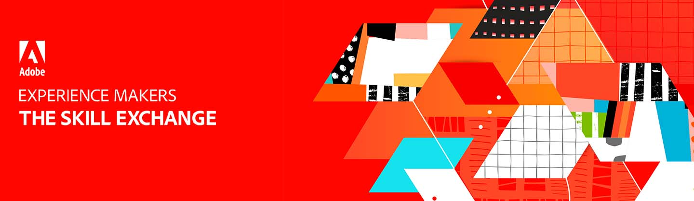

# Experience Makers Learn from your peers {#overview}

Learn from Adobe experts and peers how to get the most from your Adobe solutions. With topics selected for practitioners,  BY practitioners, these interactive sessions share "art of the possible" use cases, best practices, and tips & tricks.

>[!TIP]
>
>**All recorded sessions are listed in the navigation on the left**.

## Featured Sessions

<table>
  <tr>
   <td>
      
      

         <a href="/help/events/analytics/jun2021/tips-and-tricks.md"><strong>Adobe Analytics Getting Started</strong></a>
<!----          <em>foo</em> --->
      

      

         
         Familiarize yourself with the basic Analytics user interface and start your first project in Analysis Workspace.
      

    </td>
   <td>
      
      

         <a href="/help/events/analytics/jun2021/tips-and-tricks.md"><strong>Data Maintenance</strong></a>
<!----          <em>foo</em> --->
      

      

         
         Easy adopted methodologies to keep your most important asset clean.
      

    </td>
   <td>
      
      

         <a href="/help/events/analytics/jun2021/tips-and-tricks.md"><strong>10 Tips to Wow Your Workfront</strong></a>
<!----          <em>foo</em> --->
      

      

         
         These tips are catered to admins that have been in their instance for a while and hoping for a more efficient way to do things.
      

    </td>
  </tr>
</table>
